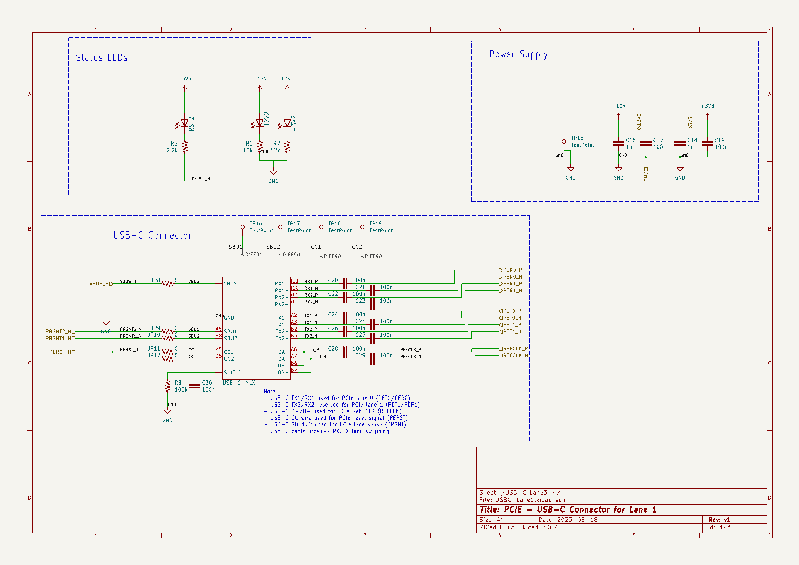
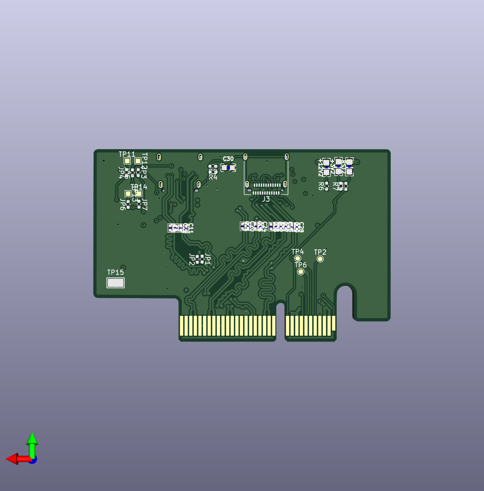

# PCIe x4 to USB-C Adaptoid

A PCIe to USB-C adapter board -- plugs into a PCIe 4x card slot to breakout the data and clock lanes to a USB-C connector. 
Includes AC coupling caps and jumper resistors to aid in debugging/hacking.
Tested up to PCIe Gen 2 at 5.0 Gbps (though threre's plenty of room for improving the signal integrity).

[] in 2nd step updating to PCIe 3.0 Standart

### Schematic

#### 
#### 
#### 

### PCB Bottom Side

#### 

### PCB Top Side

#### 

